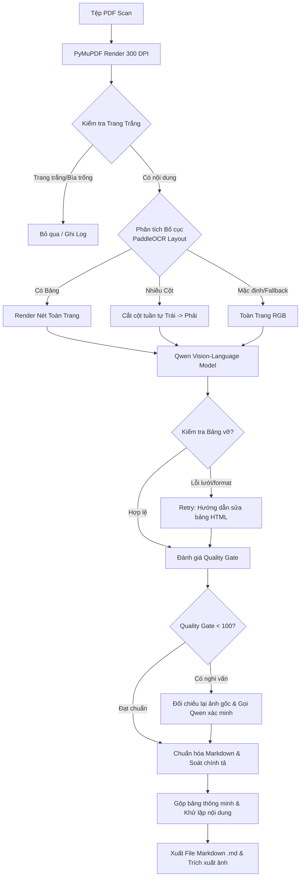

# Quy trình Xử lý & Cơ chế Hoạt động (Pipeline & Technical Workflow)

Tài liệu này mô tả chi tiết quy trình xử lý nội bộ, cơ chế hậu kiểm và các bước chuẩn hóa dữ liệu của dự án **Qwen OCR & Ollama**.

---

## 1. Sơ đồ Quy trình Tổng thể (End-to-End Pipeline)

---

## 2. Chi tiết các Bước Xử lý Chuyên sâu

### 2.1. Phân loại & Trích xuất Ảnh Nội dung
* Mỗi tài liệu tạo một file `<tên-tài-liệu>.md`; ảnh nội dung thực sự được lưu trong thư mục `images/` và liên kết từ Markdown.
* Crop hậu kiểm, overlay layout và nhật ký hiệu chỉnh chỉ tồn tại tạm thời rồi được xoá sạch sau khi hoàn tất.
* Tự động lọc bỏ toàn bộ khối ký xác nhận (chữ ký sống, dấu mộc đỏ, chức danh người ký) để bảo mật.
* Ảnh nội dung được chèn theo đúng thứ tự đọc (reading order) của văn bản.
* Chỉ gộp ảnh trùng khi dữ liệu hash file giống nhau hoàn toàn; các hình vẽ hoặc biểu đồ khác biệt luôn được giữ nguyên.

### 2.2. Gộp Bảng qua nhiều trang (Smart Table Merger)
* Tự động phát hiện và gộp các bảng biểu bị ngắt đoạn giữa các trang PDF.
* **Hỗ trợ chuỗi STT phân cấp**: Tự động nhận diện chuỗi thứ tự nhiều tầng (`4.1, 4.2` $\rightarrow$ `4.3`, `1.2.1` $\rightarrow$ `1.2.2`, `A, B` $\rightarrow$ `C`, `I, II` $\rightarrow$ `III`) để nối hàng chuẩn xác.
* **Chuẩn hóa Tiêu đề & Cột**: Làm phẳng tiêu đề nhiều tầng và cố định số cột, tránh hiện tượng lệch ô khi hiển thị Markdown.
* **Khử lặp Header tự động**: Gỡ bỏ các dòng tiêu đề cột bị lặp lại ở đầu trang tiếp theo.

### 2.3. Nhận diện & Bỏ qua Trang Trắng (Blank Page Detection)
* Kiểm tra ngay sau khi render ảnh để tiết kiệm thời gian xử lý AI.
* Tự động bóc viền đen scan mép, lỗ bấm giấy/ghim bấm, chuẩn hóa nền giấy ố vàng.
* Cung cấp 3 mức độ nhạy:
  * **Safe (An toàn - Mặc định)**: Ưu tiên không bỏ sót chữ.
  * **Standard (Chuẩn)**: Phù hợp giấy màu, chữ hằn nhẹ hoặc nhiều đường kẻ.
  * **Aggressive (Mạnh mẽ)**: Dành cho tài liệu scan cực cũ/giấy xi măng.

### 2.4. Đánh giá & Hậu kiểm Đối chiếu Ảnh (Quality Gate & Review)
* Mỗi trang thông thường chỉ cần 1 lượt OCR chính để đảm bảo tốc độ tối đa.
* Bộ kiểm tra tự động phát hiện các điểm nghi vấn: ngày tháng/số hiệu sai định dạng, mất dấu tiếng Việt diện rộng, bảng vỡ khung.
* Với những vùng nghi ngờ nghiêm trọng, hệ thống tự động crop vùng ảnh tương ứng để gửi AI đọc lại và chỉ áp dụng sửa đổi khi độ tin cậy đạt $\ge 0.98$.

### 2.5. Xử lý các Dạng Văn bản Đặc thù (Biểu mẫu, Trắc nghiệm, Ký hiệu)
* **Checkbox & Tasklist**: Nhận diện ô tích `- [x]` và ô trống `- [ ]` trên biểu mẫu, tự động chuẩn hóa các ký tự `[v]`, `[V]`, `[*]`, `☑`, `☐`.
* **Đáp án trắc nghiệm**: Chuyển đổi đáp án được khoanh tròn thành in đậm `**(A)**`, `**(B)**`, `**(C)**`, `**(D)**`.
* **Chữ viết tay sửa đổi & Gạch xóa**: Nhận diện thao tác gạch bỏ trên văn bản và lưu lại dưới dạng chữ gạch ngang `~~nội dung bị gạch~~`.
* **Ký hiệu đo lường & Toán học**: Chuẩn hóa chính xác các ký hiệu Unicode `°C`, `×`, `µ`, `±`, `≤`, `≥`, `≈`, `©`, `®`, `™`, `m²`, `m³`.
* **Khử lặp từ ảo giác**: Tự động phát hiện và cắt tỉa các cụm từ bị lặp lại nhiều lần do hiện tượng lặp từ của mô hình AI.
* **Chuẩn hóa đường dẫn ảnh CommonMark**: Tự động bọc cặp ngoặc `<images/...>` cho ảnh có tên tiếng Việt hoặc khoảng trắng để hiển thị tốt trên mọi trình xem Markdown.

---

## 3. Nguyên tắc Xử lý Tài liệu & Chữ ký Con dấu
* Nhận diện và giữ nguyên vẹn toàn bộ phần chữ in của văn bản (tên cơ quan, chức vụ, số hiệu, nội dung).
* Không suy đoán nội dung từ chữ ký tay nguệch ngoạc hoặc hình con dấu mờ.
* Tự động loại bỏ ảnh quét của chữ ký và mộc đỏ để giữ file Markdown sạch sẽ và tuân thủ an toàn thông tin.
* Hệ thống sửa chính tả chỉ đóng vai trò hỗ trợ gợi ý, không tự ý thay đổi nội dung gốc của tài liệu scan.
