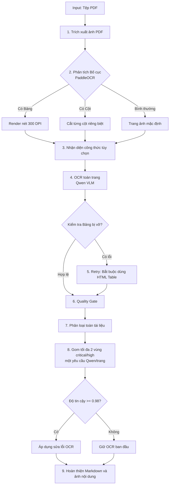

# Qwen OCR & Ollama Project

Dự án sử dụng mô hình thị giác **Qwen** chạy local qua **Ollama** để OCR tài liệu PDF thành Markdown sạch. Lõi OCR không phụ thuộc loại tài liệu; các quy tắc chuyên ngành chỉ được dùng để chọn vùng cần Qwen đọc lại từ ảnh và không trực tiếp sửa nội dung.

---

## 🌟 Các tính năng nổi bật (Mới cập nhật)

1. **Đầu ra Markdown sạch có ảnh nội dung**:
   * Mỗi tài liệu tạo một file `<tên-tài-liệu>.md`; ảnh nội dung thực sự được lưu trong thư mục `images/` và liên kết từ Markdown.
   * Crop hậu kiểm, overlay layout và nhật ký hiệu chỉnh chỉ tồn tại tạm thời rồi được xoá.
   * Bỏ toàn bộ khối ký xác nhận, gồm ảnh chữ ký/con dấu, chức danh, họ tên và chữ in thuộc khối ký.
   * Ảnh nội dung được đặt theo reading order của layout ngay cả khi Qwen quên tạo `image_placeholder`.
   * Vùng đồ họa cuối trang không rõ loại được Qwen phân loại riêng mà không OCR nội dung; chữ ký/con dấu chỉ bị loại khi được xác định chắc chắn.
   * Ảnh phân loại được thu tạm xuống tối đa 1024 px với `num_ctx=4096`; nếu vẫn vượt context, hệ thống thử lại một lần ở 768 px rồi giữ ảnh nếu chưa phân loại được.
   * Chỉ gộp ảnh trùng khi dữ liệu tệp giống hoàn toàn; ảnh gần giống hoặc chưa chắc chắn vẫn được giữ.
2. **Gộp bảng thông minh qua ranh giới trang (Smart Table Merger)**:
   * Tự động phát hiện và gộp các bảng Markdown bị phân cắt qua ranh giới trang (ví dụ bảng kéo dài từ trang trước sang trang sau).
   * Loại bỏ các dòng tiêu đề trùng lặp và khoảng trắng thừa, hợp nhất dữ liệu thành một bảng lớn duy nhất chuẩn Markdown.
3. **Render và công thức**:
   * CLI và GUI render trang OCR ở **300 DPI**; trang có bảng luôn dùng ảnh toàn trang để giữ cấu trúc hàng/cột.
   * LaTeX-OCR là thành phần tùy chọn; khi không khả dụng, Qwen tiếp tục nhận dạng công thức.
4. **Giao diện GUI chuyên nghiệp (Tkinter)**:
   * Có ô **Tự động bỏ qua trang trắng**, mặc định bật. Trang trắng được kiểm tra
     ngay sau khi render và không gửi sang DocLayout hoặc Qwen OCR.
   * Bộ phát hiện tự bóc viền scan sâu, lỗ bấm/dấu ghim ở mép, chuẩn hóa nền
     giấy xám/vàng bằng độ tương phản cục bộ và có thể loại đường kẻ lặp của
     giấy dòng/ô ly. Trang chưa đủ bằng chứng vẫn được giữ để OCR.
   * Có ba mức **Độ nhạy**: **An toàn** (mặc định, ưu tiên không mất chữ),
     **Chuẩn** (giấy màu, chữ hằn nhẹ và giấy có nhiều dòng kẻ), **Mạnh mẽ**
     (scan rất cũ/kraft; cần kiểm tra kết quả kỹ hơn).
   * Trang chỉ chứa vùng được xác định chắc chắn là chữ ký/con dấu được ghi log
     riêng và không đưa vào Markdown; quyết định dựa trên phân loại ảnh và phần
     còn lại sau khi che vùng, không dựa vào chức danh hoặc vị trí cố định. Các
     mảnh rời của một con dấu được gom thành một vùng và một trang có thể xử lý
     nhiều con dấu độc lập.
   * **Bất đồng bộ hoàn toàn (Multi-threading)**: Chạy tiến trình OCR trên luồng riêng biệt, không gây treo ứng dụng.
   * **Tiến trình 2 cấp độ (Dual Progress Bars)**: 2 thanh tiến trình trực quan hiển thị song song (Thanh 1: Tiến trình tổng số file; Thanh 2: Tiến trình số trang của file hiện tại).
   * **Trình duyệt nhật ký Console**: Nhật ký nền tối hiển thị thời gian thực chính xác tiến trình xử lý từng trang và cảnh báo chất lượng.
   * Hỗ trợ nút **Dừng lại (Stop)** an toàn, giữ nguyên các file đã hoàn thành trước đó.
5. **Layout detection không đọc chữ**:
   * PaddleOCR 3.x chỉ phát hiện khung chữ/cột và vùng bảng bằng toạ độ; không có `rec_texts` nào được đưa vào Markdown hay prompt.
   * Với trang nhiều cột, ảnh được cắt từ trái sang phải trước khi Qwen đọc. Nếu bước layout lỗi, hệ thống tự quay về gửi nguyên trang cho Qwen.
   * Có thể tắt để đo hiệu năng hoặc quay về luồng cũ: đặt `ENABLE_LAYOUT_DETECTION = False` trong `app/core/batch_ocr.py`.
6. **Theo dõi hiệu năng trong log**:
   * Hiển thị thời gian render, phân tích Paddle và Qwen theo từng trang.
   * GUI ghi tổng thời gian từng file và toàn bộ đợt OCR khi hoàn tất.
   * Thanh tiến trình dành 90% cho OCR, 4% cho hậu kiểm ảnh và phần còn lại cho hoàn thiện/ghi file; chỉ đạt 100% sau khi lưu thành công.
   * GUI hiển thị riêng các trạng thái `OCR`, `Quality retry`, `Hậu kiểm ảnh`, `Lưu kết quả` và `Đang tạm dừng`.
   * OCR chính dùng timeout 300 giây và retry tối đa hai lần. Hậu kiểm tùy chọn dùng timeout 45 giây, không retry và luôn giữ OCR ban đầu khi thất bại.
7. **Hậu kiểm dựa trên ảnh**:
   * Mỗi trang bình thường chỉ có một lượt OCR chính. `ocr_qwen_images` không tự retry bảng; quality gate là nơi duy nhất điều phối OCR lại toàn trang, tránh các retry lồng nhau.
   * Bộ kiểm tra chỉ đề cử vùng nghi ngờ, không trực tiếp sửa Markdown: ngày/số hiệu bất thường, mất dấu diện rộng, ký tự dính, dòng bị cắt, khác biệt OCR theo vùng, chữ giao với đồ họa, bảng sai lưới và khối người ký có nguy cơ thiếu.
   * Trang đạt Quality Gate 100 bỏ qua hậu kiểm dòng. Chỉ tối đa hai ứng viên `critical`/`high` được giữ; `medium`/`low` không gọi Qwen và hai vùng gần nhau được gộp thành một crop.
   * Mỗi vùng lỗi được crop kèm vùng đọc trước/sau. Từ hai vùng trở lên chiếm ít nhất 20% trang, ít nhất ba lỗi nghiêm trọng, hoặc mất dấu trên nhiều dòng thì OCR lại toàn trang; sau đó không đọc lại từng vùng. Lỗi lưới bảng được chuyển cho quality retry chuyên xử lý bảng.
   * Chỉ áp dụng thay đổi vùng khi ảnh xác nhận rõ và độ tin cậy đạt tối thiểu `0.98`; kết quả OCR lại toàn trang chỉ được chọn nếu quality gate đánh giá an toàn hơn.
   * Luồng mặc định OCR toàn trang một lần để bảo đảm tốc độ; layout chỉ hỗ trợ reading order và vị trí ảnh. OCR riêng theo vùng chỉ thực hiện khi hậu kiểm phát hiện lỗi nghiêm trọng; không hậu kiểm để bổ sung khối ký cuối tài liệu.
   * Không tự sửa lỗi chính tả vốn được in trên tài liệu. Nếu không chắc chắn, hệ thống giữ kết quả OCR đầu tiên.
8. **Phân loại chuyên ngành có kiểm soát**:
   * Không dùng danh sách từ khóa để ép tài liệu vào một loại cố định.

---

## Benchmark cấu hình laptop

Đặt đúng ba file `0001.pdf`, `0002.pdf`, `0003.pdf` trong một thư mục, sau đó kiểm tra testcase:

```powershell
python tests/benchmark_laptop_matrix.py --input test_input --dry-run
```

Chạy ma trận DPI `200/250/300` với `workers=1/2`:

```powershell
python tests/benchmark_laptop_matrix.py --input test_input --runs 1 --model qwen3.5:4b
```

Kết quả được lưu tại `output/laptop_matrix`: `results.csv`, `results.json`, `summary.json`, Markdown và log riêng của từng lượt. Nếu có ground truth, đặt `test_input/expected/0001.md`–`0003.md` để runner tính thêm CER, WER và F1 cấu trúc. Runner không tự đóng ứng dụng GPU hoặc khởi động lại Ollama.

---

## Yêu cầu hệ thống (khuyến nghị)

> Phần mềm vẫn có thể chạy khi không có GPU, nhưng Ollama sẽ chuyển sang CPU và tốc độ OCR sẽ chậm hơn đáng kể.

* **Hệ điều hành:** Windows 10/11 64-bit hoặc Linux 64-bit.
* **CPU:** Tối thiểu 4 lõi/8 luồng; khuyến nghị 8 lõi trở lên khi chạy hoàn toàn bằng CPU.
* **RAM:** Tối thiểu 16 GB; khuyến nghị 24–32 GB khi xử lý PDF dài hoặc nhiều trang độ phân giải cao.
* **GPU:** Không bắt buộc. Khuyến nghị GPU NVIDIA có CUDA và ít nhất 6 GB VRAM; 8 GB VRAM trở lên cho hiệu năng ổn định hơn.
* **Dung lượng trống:** Tối thiểu khoảng 15 GB cho mã nguồn, môi trường Python, Ollama, model `qwen3.5:4b` và cache model Paddle/Layout; cần thêm dung lượng cho PDF và kết quả OCR.
* **Phần mềm:** Python 3.10 trở lên và Ollama. Nếu dùng Docker cần Docker Desktop; chạy GPU trong Docker cần NVIDIA Container Toolkit.
* **Kết nối mạng:** Chỉ cần trong lần cài đặt và tải model ban đầu. Sau khi đã tải đủ model Qwen, Paddle/Layout và LaTeX-OCR (nếu sử dụng), hệ thống có thể hoạt động offline; Ollama chỉ được gọi tại `localhost:11434`.

### GPU và CPU fallback

* Ollama tự phát hiện GPU tương thích và ưu tiên sử dụng GPU; nếu GPU không khả dụng, model Qwen sẽ chạy bằng CPU.
* `requirements.txt` hiện cài `paddlepaddle` bản CPU. Muốn Paddle/Layout sử dụng GPU NVIDIA, cần thay bằng `paddlepaddle-gpu` tương thích với phiên bản CUDA của máy.
* Nên kiểm tra log Ollama và mức sử dụng GPU để xác nhận model thực sự đang chạy trên GPU.

---

## II. Luồng xử lý chính (Core Pipeline)

Hệ thống xử lý từng PDF qua pipeline OCR tổng quát và hậu kiểm có đối chiếu ảnh:



1. **Trích xuất ảnh (Render):** Chuyển đổi các trang PDF thành ảnh PNG thông qua `PyMuPDF`.
2. **Phân tích bố cục (Layout Detection):** Dùng `PaddleOCR` (tuỳ chọn) quét toạ độ cột văn bản, bảng biểu và hình vẽ.
   - *Nếu có bảng:* Tự động render lại trang với độ phân giải siêu nét (300 DPI) để chống vỡ chữ.
   - *Nếu chia cột:* Tự động cắt riêng từng cột và đọc tuần tự từ trái qua phải.
3. **Nhận diện công thức:** Vùng công thức có thể được đọc riêng bằng `LaTeX-OCR`; crop chỉ nằm trong thư mục tạm.
4. **Nhận diện bằng AI:** Qwen OCR toàn trang và chỉ chép nội dung nhìn thấy. Layout là gợi ý hình học; riêng toàn bộ khối ký xác nhận được bỏ khỏi Markdown.
5. **Cơ chế tự sửa lỗi (Self-Correction):** Nếu phát hiện Qwen xuất bảng bị vỡ hoặc sai định dạng Markdown, hệ thống tự động bắt AI chạy lại (Retry) với hướng dẫn sửa lỗi cấu trúc bảng HTML.
6. **Quality gate:** Kiểm tra bảng, Markdown, LaTeX, nội dung lặp, mất dấu diện rộng và placeholder. Lỗi diện rộng làm Qwen OCR lại toàn trang.
7. **Hậu kiểm không phụ thuộc loại tài liệu:** Khi trang cuối có vùng đồ họa cần đối chiếu, hệ thống kiểm tra vùng cuối mà không yêu cầu `Số`, `Nơi nhận`, tên cơ quan hay chức danh cố định.
8. **Hậu kiểm bằng ảnh:** Từ điển và heuristic chỉ tìm ứng viên; cảnh báo nhẹ không gọi Qwen. Các crop nghiêm trọng được đọc trong một batch; kết quả JSON không hợp lệ, thay đổi quá rộng hoặc độ tin cậy dưới `0.98` đều bị từ chối.
9. **Hoàn thiện:** Gộp trang/bảng, chuẩn hóa cấu trúc, ghi file Markdown và chỉ giữ các ảnh nội dung được Markdown tham chiếu.

### Nguyên tắc chữ ký, con dấu và chính tả

* OCR và giữ chữ in như chức danh, tên cơ quan, họ tên và `Nơi nhận`.
* Không biến nét ký tay hoặc hình con dấu thành văn bản suy đoán.
* Không OCR hoặc chèn ảnh của toàn bộ khối ký xác nhận, gồm chức danh, họ tên, chữ ký và con dấu.
* Bộ kiểm tra chính tả không trực tiếp sửa Markdown. Mọi sửa đổi phải được Qwen xác minh lại từ ảnh.
* Lỗi chính tả có sẵn trên bản gốc được giữ nguyên; Markdown không thay thế giá trị pháp lý của PDF nguồn.

---

## III. Hai cách thiết lập dịch vụ Ollama (Ollama Server)

Để phục vụ OCR, bạn cần có một Ollama Server chạy model `qwen3.5:4b`. Dự án hỗ trợ 2 cách thiết lập sau (chọn 1 trong 2 cách):

### Cách 1: Thiết lập trực tiếp trên máy thật (Khuyên dùng khi Dev/Debug)
* **Đặc điểm:** Tận dụng tối đa phần cứng/GPU của máy thật, dễ chạy trực tiếp mà không cần cài đặt Docker.
* **Các bước thực hiện:**
  1. Tải và cài đặt Ollama từ trang chủ: [https://ollama.com](https://ollama.com).
  2. Đảm bảo ứng dụng Ollama đã được mở và đang chạy ngầm dưới khay hệ thống.
  3. Mở Terminal/CMD và tải về mô hình Qwen phục vụ cho OCR:
     ```bash
     ollama pull qwen3.5:4b
     ```

### Cách 2: Thiết lập thông qua Docker (Đóng gói sẵn Model - Phù hợp Deploy/Chuyển giao offline)
* **Đặc điểm:** Không cần cài đặt Ollama thủ công, model `qwen3.5:4b` được đóng gói sẵn hoàn toàn bên trong Docker Image (chạy được offline trên các máy khác ngay lập tức không cần tải lại).
* **Các bước thực hiện:**
  1. Yêu cầu máy đã cài đặt **Docker** và **Docker Desktop**.
  2. **Build Docker Image** (Tự động kéo và đóng gói sẵn model):
     ```bash
     docker build -t local-ollama-qwen .
     ```
  3. **Khởi chạy container**:
     ```bash
     docker run -d -p 11434:11434 --name my-ollama local-ollama-qwen
     ```
     *(Lưu ý: Nếu sử dụng cách này, hãy tắt ứng dụng Ollama trên máy thật nếu đang bật để tránh xung đột cổng `11434`).*

---

## IV. Các bước thiết lập môi trường Python chạy Code (Client)

Dù bạn chọn cách chạy Ollama nào ở trên (Cách 1 hay Cách 2), bạn vẫn cần cấu hình môi trường Python trên máy thật để chạy mã nguồn dự án:

1. Đảm bảo máy bạn đã cài đặt **Python 3.10 trở lên**.
2. Mở Terminal tại thư mục gốc của dự án (`qwen-ocr-ollama`) và chạy lần lượt các lệnh:

### Bước 1: Khởi tạo môi trường ảo (Virtual Environment)
```bash
python -m venv .venv
```

### Bước 2: Kích hoạt môi trường ảo
* **Trên Windows (PowerShell):**
  ```powershell
  .\.venv\Scripts\Activate.ps1
  ```
* **Trên Windows (CMD):**
  ```cmd
  .\.venv\Scripts\activate.bat
  ```
* **Trên macOS / Linux:**
  ```bash
  source .venv/bin/activate
  ```
*(Khi kích hoạt thành công, bạn sẽ thấy chữ `(.venv)` xuất hiện ở đầu dòng lệnh).*

### Bước 3: Cài đặt các thư viện Python
```bash
pip install -r requirements.txt
```

Nhận diện công thức chuyên biệt bằng LaTeX-OCR là tính năng tùy chọn. Cài thêm khi cần:

```bash
pip install -r requirements-formula.txt
```

Nếu `pix2tex` hoặc model của nó không khả dụng, CLI/GUI sẽ thông báo rõ và tiếp tục dùng Qwen để nhận diện công thức; tác vụ OCR không bị dừng.

### Cấu hình Layout Detection offline

Paddle layout mặc định bỏ qua kiểm tra kết nối tới các model hoster. Có thể cấu hình thêm bằng biến môi trường:

```powershell
# Tắt hoàn toàn layout detection và luôn OCR nguyên trang
$env:QWEN_OCR_DISABLE_LAYOUT="1"

# Hoặc chỉ định model local rõ ràng
$env:QWEN_OCR_TEXT_DETECTION_MODEL_DIR="D:\models\text_detection"
$env:QWEN_OCR_LAYOUT_MODEL_DIR="D:\models\layout_detection"
```

PaddleX mặc định dùng cache model đã cài trong hồ sơ người dùng (thường là `C:\Users\<user>\.paddlex`). Khi đóng gói offline, có thể chỉ định rõ hai thư mục model bằng các biến `QWEN_OCR_TEXT_DETECTION_MODEL_DIR` và `QWEN_OCR_LAYOUT_MODEL_DIR` ở trên.

CLI và GUI sẽ ghi rõ `layout enabled` hoặc `layout disabled` vào log khi bắt đầu xử lý.

---

## V. Hướng dẫn sử dụng các công cụ chính

Các script nghiệp vụ chính đã được tổ chức lại trong thư mục `app/` và có các file chuyển tiếp (wrappers) ở thư mục gốc để thuận tiện gọi lệnh:

### 1. Khởi chạy Giao diện Đồ họa (GUI)
Công cụ đồ họa Tkinter để chuyển đổi PDF trực quan, hỗ trợ chọn file/folder, hiển thị 2 thanh tiến trình và nhật ký thời gian thực.
```powershell
.\.venv\Scripts\Activate.ps1
python run_gui.py
```

### 2. Xử lý hàng loạt qua dòng lệnh (Batch OCR)
Tự động quét tất cả PDF trong thư mục `PDF/` và ghi một file Markdown cho mỗi tài liệu vào `OCR/`:
```bash
python batch_ocr.py
```

Có thể chỉ định đầu vào, đầu ra, model và số luồng:

```powershell
python batch_ocr.py --input PDF --output OCR --model qwen3.5:4b --workers 1
```

Mặc định hệ thống dùng mức phát hiện trang trắng `safe`. Với tài liệu scan cũ,
giấy màu hoặc giấy kẻ, có thể chọn mức khác:

```powershell
python batch_ocr.py --input PDF --output OCR --blank-sensitivity standard
python batch_ocr.py --input PDF --output OCR --blank-sensitivity aggressive
```

Ba giá trị hợp lệ là `safe`, `standard` và `aggressive`. Dùng
`--keep-blank-pages` nếu muốn tắt hoàn toàn việc bỏ qua trang trắng và gửi mọi
trang sang OCR.

Pipeline batch hiện nhận file PDF hoặc thư mục chứa PDF. Nội dung bên trong có thể thuộc nhiều loại tài liệu; quy tắc chuyên ngành không thay thế lõi OCR tổng quát.

### 3. Bộ kiểm tra chất lượng kết quả (OCR Validator)
Kiểm tra cấu trúc và tính hợp lệ của tệp Markdown sau OCR (lỗi KaTeX, công thức toán bị gom cụm, lỗi thẻ ảnh):
```bash
python ocr_validator.py
```

---

## VI. Cấu trúc thư mục dự án

```text
qwen-ocr-ollama/
│
├── .venv/                      # Môi trường ảo Python (được ignore trên Git)
├── app/
│   ├── core/                   # Logic cốt lõi xử lý OCR, render PDF
│   │   ├── batch_ocr.py        # Pipeline OCR hàng loạt dùng chung cho CLI/GUI
│   │   ├── block_assembler.py  # Lắp ráp khối chữ, bảng và ảnh theo luồng đọc
│   │   ├── formula_ocr.py      # Nhận diện công thức tùy chọn bằng LaTeX-OCR
│   │   ├── image_grounded_review.py # Phát hiện ứng viên, crop tạm và xác minh lại bằng ảnh
│   │   ├── layout_detector.py  # PaddleOCR layout, cột, bảng, ảnh và overlay
│   │   ├── math_cleanup.py     # Chuẩn hóa và kiểm tra cấu trúc LaTeX/đáp án
│   │   ├── ocr_metrics.py      # Chỉ số đánh giá kết quả OCR/Markdown
│   │   ├── ocr_validator.py    # Kiểm tra tính hợp lệ của Markdown đầu ra
│   │   ├── ollama_engine.py    # Adapter Qwen Vision qua Ollama
│   │   ├── paddle_engine.py    # Adapter PaddleOCR và sắp xếp dòng theo tọa độ
│   │   ├── pdf_ocr.py          # Điều phối OCR PDF và ưu tiên text layer
│   │   ├── pdf_renderer.py     # API duy nhất render toàn bộ hoặc trang PDF chọn lọc
│   │   ├── pdf_rerender.py     # Shim tương thích, re-export từ pdf_renderer
│   │   ├── pdf_text_layer.py   # Phát hiện và trích xuất text layer PDF
│   │   └── quality_gate.py     # Quality gate, cảnh báo, retry và chọn bản tốt nhất
│   │
│   └── gui/                    # Giao diện đồ họa ứng dụng
│       └── run_gui.py          # Triển khai giao diện đồ họa Tkinter
│
├── PDF/                        # Thư mục chứa các tệp PDF đầu vào mặc định
├── OCR/                        # Thư mục chứa các file Markdown đầu ra mặc định
├── samples/                    # Dữ liệu mẫu thử nghiệm
├── tests/                      # Unit test, integration test và benchmark
│   ├── test_*.py               # Bộ kiểm thử tự động
│   ├── test_benchmark_images.py # Benchmark OCR ảnh lặp lại
│   └── benchmark_dpi.py        # Benchmark lựa chọn DPI
│
├── run_gui.py                  # File chuyển tiếp khởi chạy GUI từ thư mục gốc
├── batch_ocr.py                # File chuyển tiếp chạy Batch OCR từ thư mục gốc
├── ocr_validator.py            # File chuyển tiếp chạy Validator từ thư mục gốc
├── requirements.txt            # Danh sách thư viện phụ thuộc
├── requirements-formula.txt    # Dependency tùy chọn cho LaTeX-OCR/pix2tex
└── README.md                   # Hướng dẫn cài đặt và sử dụng dự án (File này)
```
