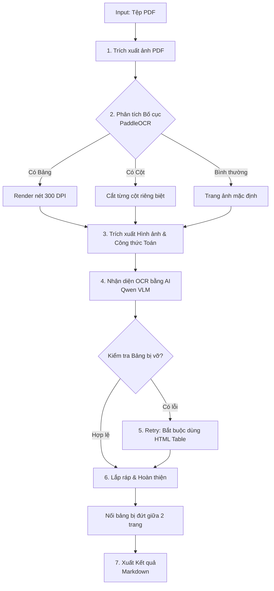

# Qwen OCR & Ollama Project

Dự án sử dụng mô hình thị giác (Vision Language Model) **Qwen** chạy local thông qua **Ollama** để nhận diện ký tự quang học (OCR) tài liệu tiếng Việt dạng hình ảnh và PDF sang định dạng Markdown chuẩn, hỗ trợ dịch công thức toán học (LaTeX) và trích xuất hình vẽ (diagram).

---

## 🌟 Các tính năng nổi bật (Mới cập nhật)

1. **Trích xuất hình vẽ & Tự động liên kết (Real Image Extraction)**:
   * Tự động quét và trích xuất tất cả các tệp hình ảnh, sơ đồ hình học, biểu đồ thực tế từ tệp PDF gốc lưu vào thư mục `images/`.
   * Tự động thay thế đường dẫn giả lập thành đường dẫn tệp tin thực tế trong file Markdown kết quả để hiển thị trực tiếp sơ đồ lên tài liệu Markdown.
2. **Gộp bảng thông minh qua ranh giới trang (Smart Table Merger)**:
   * Tự động phát hiện và gộp các bảng Markdown bị phân cắt qua ranh giới trang (ví dụ bảng kéo dài từ trang trước sang trang sau).
   * Loại bỏ các dòng tiêu đề trùng lặp và khoảng trắng thừa, hợp nhất dữ liệu thành một bảng lớn duy nhất chuẩn Markdown.
3. **Độ phân giải & Tăng cường hình ảnh**:
   * Render trang thường ở **150 DPI (CLI)** hoặc **200 DPI (GUI)**; trang có bảng được render lại ở **300 DPI**.
   * Tiền xử lý tăng cường độ tương phản (Contrast Enhancement) giúp làm sắc nét nét chữ, tăng độ chính xác nhận dạng đối với các ký tự toán học nhỏ.
4. **Giao diện GUI chuyên nghiệp (Tkinter)**:
   * **Bất đồng bộ hoàn toàn (Multi-threading)**: Chạy tiến trình OCR trên luồng riêng biệt, không gây treo ứng dụng.
   * **Tiến trình 2 cấp độ (Dual Progress Bars)**: 2 thanh tiến trình trực quan hiển thị song song (Thanh 1: Tiến trình tổng số file; Thanh 2: Tiến trình số trang của file hiện tại).
   * **Trình duyệt nhật ký Console**: Nhật ký nền tối hiển thị thời gian thực chính xác tiến trình xử lý từng trang và cảnh báo chất lượng.
   * Hỗ trợ nút **Dừng lại (Stop)** an toàn, giữ nguyên các file đã hoàn thành trước đó.
5. **Layout detection không đọc chữ**:
   * PaddleOCR 3.x chỉ phát hiện khung chữ/cột và vùng bảng bằng toạ độ; không có `rec_texts` nào được đưa vào Markdown hay prompt.
   * Với trang nhiều cột, ảnh được cắt từ trái sang phải trước khi Qwen đọc. Nếu bước layout lỗi, hệ thống tự quay về gửi nguyên trang cho Qwen.
   * Có thể tắt để đo hiệu năng hoặc quay về luồng cũ: đặt `ENABLE_LAYOUT_DETECTION = False` trong `app/core/batch_ocr.py`.
6. **Theo dõi hiệu năng trong log**:
   * Hiển thị thời gian render, phân tích Paddle và Qwen theo từng trang.
   * GUI ghi tổng thời gian từng file và toàn bộ đợt OCR khi hoàn tất.

---

## II. Luồng xử lý chính (Core Pipeline)

Hệ thống xử lý từng file PDF qua luồng đa bước (pipeline) tự động để đảm bảo cấu trúc, bảng biểu, công thức toán và hình ảnh được giữ nguyên vẹn nhất:



1. **Trích xuất ảnh (Render):** Chuyển đổi các trang PDF thành ảnh PNG thông qua `PyMuPDF`.
2. **Phân tích bố cục (Layout Detection):** Dùng `PaddleOCR` (tuỳ chọn) quét toạ độ cột văn bản, bảng biểu và hình vẽ.
   - *Nếu có bảng:* Tự động render lại trang với độ phân giải siêu nét (300 DPI) để chống vỡ chữ.
   - *Nếu chia cột:* Tự động cắt riêng từng cột và đọc tuần tự từ trái qua phải.
3. **Trích xuất Hình ảnh & Toán học:** 
   - Hình vẽ, sơ đồ trên trang được cắt và lưu thành file thật vào thư mục `images/`.
   - Vùng công thức toán học được trích xuất riêng biệt bằng `LaTeX-OCR` để lấy mã LaTeX chuẩn.
4. **Nhận diện bằng AI (Vision VLM OCR):** Gửi ảnh qua mô hình `Qwen` (Ollama) kèm theo hướng dẫn prompt nghiêm ngặt. Các hình vẽ và công thức được Qwen đặt "placeholder" (giữ chỗ).
5. **Cơ chế tự sửa lỗi (Self-Correction):** Nếu phát hiện Qwen xuất bảng bị vỡ hoặc sai định dạng Markdown, hệ thống tự động bắt AI chạy lại (Retry) với hướng dẫn sửa lỗi cấu trúc bảng HTML.
6. **Lắp ráp & Hoàn thiện (Post-processing):** 
   - Thay thế placeholder bằng mã LaTeX gốc và đường dẫn hình ảnh vật lý.
   - Khi layout có đủ tọa độ, OCR riêng block tiêu đề/văn bản/bảng và chèn block ảnh trực tiếp theo reading order; placeholder chỉ còn là fallback.
   - Gộp các trang lại và kích hoạt **Smart Table Merger** để nối các bảng bị ngắt quãng giữa 2 trang.
7. **Xuất kết quả:** Lưu file `.md` cuối cùng; thời gian chi tiết được ghi trong log chạy.

---

## III. Hai cách thiết lập dịch vụ Ollama (Ollama Server)

Để phục vụ OCR, bạn cần có một Ollama Server chạy model `qwen3.5:4b`. Dự án hỗ trợ 2 cách thiết lập sau (chọn 1 trong 2 cách):

### Cách 1: Thiết lập trực tiếp trên máy thật (Khuyên dùng khi Dev/Debug)
* **Đặc điểm:** Tận dụng tối đa phần cứng/GPU của máy thật, dễ chạy trực tiếp mà không cần cài đặt Docker.
* **Các bước thực hiện:**
  1. Tải và cài đặt Ollama từ trang chủ: [https://ollama.com](https://ollama.com).
  2. Đảm bảo ứng dụng Ollama đã được mở và đang chạy ngầm dưới khay hệ thống.
  3. Mở Terminal/CMD và tải về mô hình Qwen phục vụ cho OCR:
     ```bash
     ollama pull qwen3.5:4b
     ```

### Cách 2: Thiết lập thông qua Docker (Đóng gói sẵn Model - Phù hợp Deploy/Chuyển giao offline)
* **Đặc điểm:** Không cần cài đặt Ollama thủ công, model `qwen3.5:4b` được đóng gói sẵn hoàn toàn bên trong Docker Image (chạy được offline trên các máy khác ngay lập tức không cần tải lại).
* **Các bước thực hiện:**
  1. Yêu cầu máy đã cài đặt **Docker** và **Docker Desktop**.
  2. **Build Docker Image** (Tự động kéo và đóng gói sẵn model):
     ```bash
     docker build -t local-ollama-qwen .
     ```
  3. **Khởi chạy container**:
     ```bash
     docker run -d -p 11434:11434 --name my-ollama local-ollama-qwen
     ```
     *(Lưu ý: Nếu sử dụng cách này, hãy tắt ứng dụng Ollama trên máy thật nếu đang bật để tránh xung đột cổng `11434`).*

---

## IV. Các bước thiết lập môi trường Python chạy Code (Client)

Dù bạn chọn cách chạy Ollama nào ở trên (Cách 1 hay Cách 2), bạn vẫn cần cấu hình môi trường Python trên máy thật để chạy mã nguồn dự án:

1. Đảm bảo máy bạn đã cài đặt **Python 3.10 trở lên**.
2. Mở Terminal tại thư mục gốc của dự án (`qwen-ocr-ollama`) và chạy lần lượt các lệnh:

### Bước 1: Khởi tạo môi trường ảo (Virtual Environment)
```bash
python -m venv .venv
```

### Bước 2: Kích hoạt môi trường ảo
* **Trên Windows (PowerShell):**
  ```powershell
  .\.venv\Scripts\Activate.ps1
  ```
* **Trên Windows (CMD):**
  ```cmd
  .\.venv\Scripts\activate.bat
  ```
* **Trên macOS / Linux:**
  ```bash
  source .venv/bin/activate
  ```
*(Khi kích hoạt thành công, bạn sẽ thấy chữ `(.venv)` xuất hiện ở đầu dòng lệnh).*

### Bước 3: Cài đặt các thư viện Python
```bash
pip install -r requirements.txt
```

Nhận diện công thức chuyên biệt bằng LaTeX-OCR là tính năng tùy chọn. Cài thêm khi cần:

```bash
pip install -r requirements-formula.txt
```

Nếu `pix2tex` hoặc model của nó không khả dụng, CLI/GUI sẽ thông báo rõ và tiếp tục dùng Qwen để nhận diện công thức; tác vụ OCR không bị dừng.

### Cấu hình Layout Detection offline

Paddle layout mặc định bỏ qua kiểm tra kết nối tới các model hoster. Có thể cấu hình thêm bằng biến môi trường:

```powershell
# Tắt hoàn toàn layout detection và luôn OCR nguyên trang
$env:QWEN_OCR_DISABLE_LAYOUT="1"

# Hoặc chỉ định model local rõ ràng
$env:QWEN_OCR_TEXT_DETECTION_MODEL_DIR="D:\models\text_detection"
$env:QWEN_OCR_LAYOUT_MODEL_DIR="D:\models\layout_detection"
```

PaddleX mặc định dùng cache model đã cài trong hồ sơ người dùng (thường là `C:\Users\<user>\.paddlex`). Khi đóng gói offline, có thể chỉ định rõ hai thư mục model bằng các biến `QWEN_OCR_TEXT_DETECTION_MODEL_DIR` và `QWEN_OCR_LAYOUT_MODEL_DIR` ở trên.

CLI và GUI sẽ ghi rõ `layout enabled` hoặc `layout disabled` vào log khi bắt đầu xử lý.

---

## V. Hướng dẫn sử dụng các công cụ chính

Các script nghiệp vụ chính đã được tổ chức lại trong thư mục `app/` và có các file chuyển tiếp (wrappers) ở thư mục gốc để thuận tiện gọi lệnh:

### 1. Khởi chạy Giao diện Đồ họa (GUI)
Công cụ đồ họa Tkinter để chuyển đổi PDF trực quan, hỗ trợ chọn file/folder, hiển thị 2 thanh tiến trình và nhật ký thời gian thực.
```bash
.\.venv\Scripts\Activate.ps1
```

### 2. Xử lý hàng loạt qua dòng lệnh (Batch OCR)
Tự động quét tất cả tệp PDF trong thư mục `PDF/` và xuất kết quả sang thư mục `OCR/` dưới định dạng Markdown & hình ảnh trích xuất:
```bash
python batch_ocr.py
```

### 3. Bộ kiểm tra chất lượng kết quả (OCR Validator)
Kiểm tra cấu trúc và tính hợp lệ của tệp Markdown sau OCR (lỗi KaTeX, công thức toán bị gom cụm, lỗi thẻ ảnh):
```bash
python ocr_validator.py
```

---

## VI. Cấu trúc thư mục dự án

```text
qwen-ocr-ollama/
│
├── .venv/                      # Môi trường ảo Python (được ignore trên Git)
├── app/
│   ├── core/                   # Logic cốt lõi xử lý OCR, render PDF
│   │   ├── batch_ocr.py        # Pipeline OCR hàng loạt dùng chung cho CLI/GUI
│   │   ├── block_assembler.py  # Lắp ráp khối chữ, bảng và ảnh theo luồng đọc
│   │   ├── formula_ocr.py      # Nhận diện công thức tùy chọn bằng LaTeX-OCR
│   │   ├── layout_detector.py  # PaddleOCR layout, cột, bảng, ảnh và overlay
│   │   ├── math_cleanup.py     # Chuẩn hóa và kiểm tra cấu trúc LaTeX/đáp án
│   │   ├── ocr_metrics.py      # Chỉ số đánh giá kết quả OCR/Markdown
│   │   ├── ocr_validator.py    # Kiểm tra tính hợp lệ của Markdown đầu ra
│   │   ├── ollama_engine.py    # Adapter Qwen Vision qua Ollama
│   │   ├── paddle_engine.py    # Adapter PaddleOCR và sắp xếp dòng theo tọa độ
│   │   ├── pdf_ocr.py          # Điều phối OCR PDF và ưu tiên text layer
│   │   ├── pdf_renderer.py     # API duy nhất render toàn bộ hoặc trang PDF chọn lọc
│   │   ├── pdf_rerender.py     # Shim tương thích, re-export từ pdf_renderer
│   │   ├── pdf_text_layer.py   # Phát hiện và trích xuất text layer PDF
│   │   └── quality_gate.py     # Quality gate, cảnh báo, retry và chọn bản tốt nhất
│   │
│   └── gui/                    # Giao diện đồ họa ứng dụng
│       └── run_gui.py          # Triển khai giao diện đồ họa Tkinter
│
├── PDF/                        # Thư mục chứa các tệp PDF đầu vào mặc định
├── OCR/                        # Thư mục chứa kết quả Markdown & ảnh (images/) đầu ra mặc định
├── samples/                    # Dữ liệu mẫu thử nghiệm
├── tests/                      # Unit test, integration test và benchmark
│   ├── test_*.py               # Bộ kiểm thử tự động
│   ├── test_benchmark_images.py # Benchmark OCR ảnh lặp lại
│   └── benchmark_dpi.py        # Benchmark lựa chọn DPI
│
├── run_gui.py                  # File chuyển tiếp khởi chạy GUI từ thư mục gốc
├── batch_ocr.py                # File chuyển tiếp chạy Batch OCR từ thư mục gốc
├── ocr_validator.py            # File chuyển tiếp chạy Validator từ thư mục gốc
├── requirements.txt            # Danh sách thư viện phụ thuộc
├── requirements-formula.txt    # Dependency tùy chọn cho LaTeX-OCR/pix2tex
└── README.md                   # Hướng dẫn cài đặt và sử dụng dự án (File này)
```
